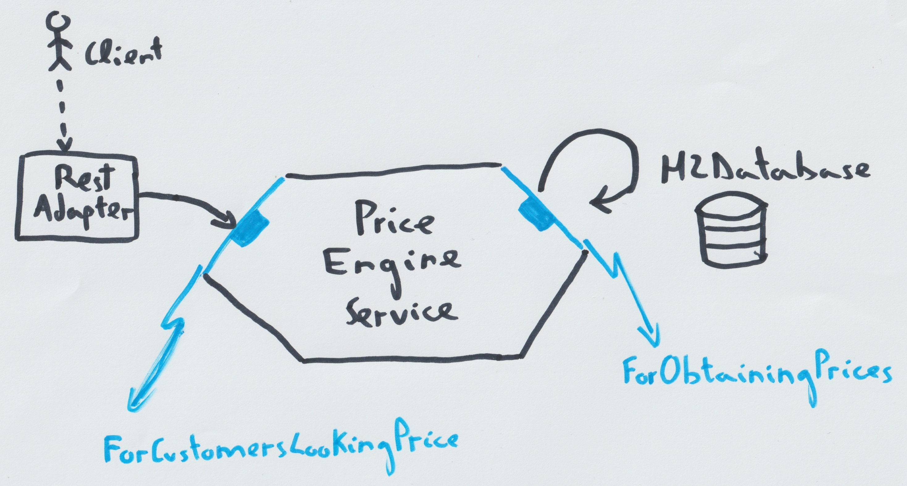

# Price Engine Service

## An implementation of the application using the hexagonal architecture pattern.



This in an application that implements a price engine.

- Drivers: Users of the application. whether it be an individual or another program.
- Driving: The driver actors driving the application via Rest API.
- Driven: The driven port has been implemented with an adapter that uses an H2 database.

# Execute acceptance test

```bash
mvn clean install -Dmaven.test.skip
docker build -t price-engine-test .
docker run --rm -it price-engine-test
```